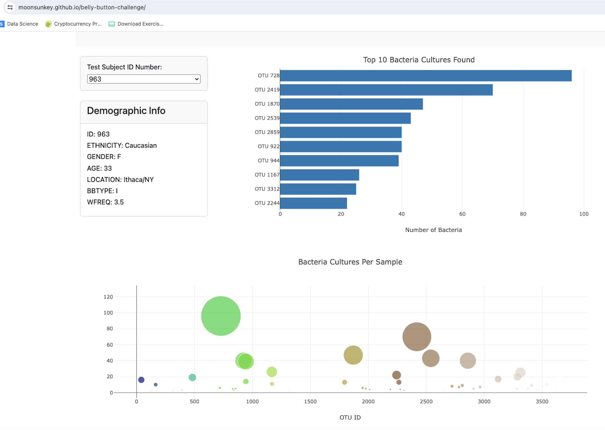

# Belly-Button Biodiversity Dashboard

## Overview

This project visualizes the bacterial data from different individuals’ belly buttons. It utilizes interactive charts to display the microbial species (also known as OTUs) found in each individual's navel.

## Features

### Metadata Panel Function

**Data Overview**:
- The data includes arrays such as `names`, `metadata`, and `samples`.
- **Metadata**: Contains key-value pairs with "id", "ethnicity", "gender", "age", "location", "bbtype", and "wfreq". Note: "id" in metadata is an integer.

- **Samples**: Contains "id", "otu_ids", "sample_values", and "otu_labels". Note: "id" in samples is a string, which requires conversion to an integer using `parseInt()` to match with metadata ids.

**Functionality**:
- Uses `Object.entries()` to convert an object into an array of enumerable property [key, value] pairs for looping.

### Chart Functions

#### Bubble and Horizontal Bar Chart

- **Bubble Chart**: Displays each sample's metadata to showcase an individual's demographic information.
- **Bar Chart**: Filters and sorts the data to be used. It slices and reverses the top 10 bacterial counts to display the top 10 bacteria found in each individual.

### Option Changed Function

- Accommodates changes from user input, i.e., when selecting a new sample from the dropdown menu.

## Dashboard Images

Below are two example images of the dashboard showing different individual samples:

## Deployment

The dashboard is deployed on GitHub Pages and can be accessed [here](https://moonsunkey.github.io/belly-button-challenge/).

## Acknowledgements

- **Data Parsing**: A tutor assisted with the `Object.entries`, `metadata`, and `optionChanged` functions.
- **Chart Development**: Charts were constructed with reference to [Plotly's JavaScript documentation](https://plotly.com/javascript/) and additional support from Google searches.
